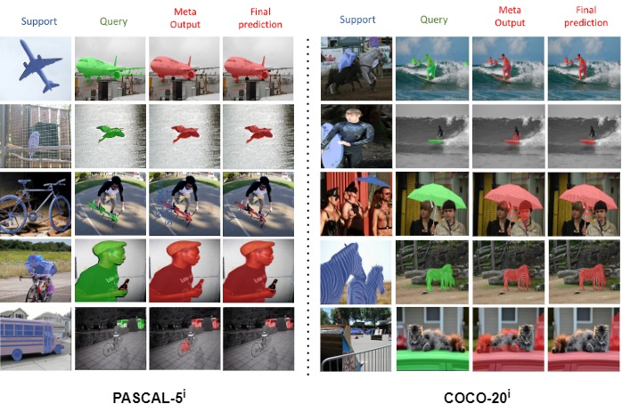

# New Title for accepted Paper: Few-Shot Segmentation using Multi-Similarity and Attention Guidance
# ARXIV Paper Title MSANet: Multi-Similarity and Attention Guidance for Boosting Few-Shot Segmentation
This is the official implementation of the paper [Few-Shot Segmentation using Multi-Similarity and Attention Guidance](https://ieeexplore.ieee.org/abstract/document/11095423)


Authors: Ehtesham Iqbal; Sirojbek Safarov; Seongdeok Bang; Sajid Javed; Yahya Zweiri; Yusra Abdulrahman

> **Abstract:** *Few-shot segmentation (FSS) methods aim to segment objects of novel classes with relatively few annotated samples. Prototype learning, a popular approach in FSS, employs prototype vectors to transfer information from known classes (support images) to novel classes(query images) for segmentation. However, using only prototype vectors may not be sufficient to represent all features of the support image. To extract abundant features and make more precise predictions, we propose a Multi-Similarity and Attention Network (MSANet) including two novel modules, a multi-similarity module and an attention module. The multi-similarity module exploits multiple feature-map of support images and query images to estimate accurate semantic relationships. The attention module instructs the MSANet to concentrate on class-relevant information. We evaluated the proposed network on standard FSS datasets, PASCAL-5i 1-shot, PASCAL-5i 5-shot, COCO-20i 1-shot, and COCO-20i 5-shot. An MSANet model with a ResNet101 backbone achieved state-of-the-art performance for all four benchmark datasets with mean intersection over union (mIoU) values of 69.13%, 73.99%, 51.09%, and 56.80%, respectively. The code used is available at https://github.com/AIVResearch/MSANet.*

<p align="middle">
  
</p>

### Dependencies

- Python 3.9
- PyTorch 1.11.0
- cuda 11.0
- torchvision 0.8.1
- tensorboardX 2.14

### Datasets
Download PASCAL, COCO and Base annotation dataset and put in MSANet/data directrory.
- PASCAL-5<sup>i</sup>:  [VOC2012](http://host.robots.ox.ac.uk/pascal/VOC/voc2012/) + [SBD](http://home.bharathh.info/pubs/codes/SBD/download.html)

- COCO-20<sup>i</sup>:  [COCO2014](https://cocodataset.org/#download)
- Download base annotation created by BAM from [here](https://github.com/chunbolang/BAM) 

   Download the [data](https://aivkr-my.sharepoint.com/:f:/g/personal/safarov_sirojbek_aiv_ai/EsTvSTPyp_NCq-RIifEAnSMBy8BfNX2iVlfZZ0nSnwi3RQ?e=d3OWUj) lists (.txt files) and put them into the `MSANet/lists` directory.

### Models

- Download the pre-trained backbones from [here](https://aivkr-my.sharepoint.com/:f:/g/personal/safarov_sirojbek_aiv_ai/EnGqMXVD5N5HrNgAKDpx0kUB0xo720V5L0VWRwHvVOKukw?e=90JVzl) and put them into the `MSANet/initmodel` directory. 
- Download our trained base learners from [OneDrive](https://aivkr-my.sharepoint.com/:f:/g/personal/safarov_sirojbek_aiv_ai/EsAKfmsEqp5DmJ4gaiUtRqUB9b256ObgzfVZ-U-R50IlFw?e=z5HIM6) and put them under `initmodel/PSPNet`. 
- We provide all trained MSANet [models](https://aivkr-my.sharepoint.com/:f:/g/personal/safarov_sirojbek_aiv_ai/EjDn3jyTVWFHso3uX8_AgSgBj1y_nB3hQ0wP8RS9aE6Cdw?e=DbT3eH) for performance evaluation. _Backbone: VGG16 & ResNet50; Dataset: PASCAL-5<sup>i</sup> & COCO-20<sup>i</sup>; Setting: 1-shot & 5-shot_.

### Scripts

- Change configuration and add weight path to `.yaml` files in `MSHNet/config` , then run the `test.py` file for testing.

### Performance

Performance comparison with the state-of-the-art approaches (*i.e.*, [HSNet](https://github.com/juhongm999/hsnet), [BAM](https://github.com/chunbolang/BAM) and [VAT](https://github.com/Seokju-Cho/Volumetric-Aggregation-Transformer) in terms of **average** **mIoU** across all folds. 

1. ##### PASCAL-5<sup>i</sup>

   | Backbone  | Method      | 1-shot                   | 5-shot                   |
   | --------  | ----------- | ------------------------ | ------------------------ |
   | VGG16     | BAM         | 64.41                    | 68.76                    |
   |           | MSANet(ours)| 65.76 <sub>(+1.35)</sub> | 70.40 <sub>(+1.64)</sub> |
   | ResNet50  | BAM         | 67.81                    | 70.91                    |
   |           | MSANet(ours)| 68.52 <sub>(+0.71)</sub> | 72.60 <sub>(+1.69)</sub> |
   | ResNet101 | VAT         | 67.50                    | 71.60                    |
   |           | MSANet(ours)| 69.13 <sub>(+1.63)</sub> | 73.99 <sub>(+2.39)</sub> |

2. ##### COCO-20<sup>i</sup>

   | Backbone | Method      | 1-shot                   | 5-shot                   |
   | -------- | ----------- | ------------------------ | ------------------------ |
   | ResNet50 | BAM         | 46.23                    | 51.16                    |
   |          | MSANet(ours)| 48.03 <sub>(+1.8)</sub>  | 53.67 <sub>(+2.51)</sub> |
   | ResNet101| HSNet       | 41.20                    | 49.50                    |
   |          | MSANet(ours)| 51.09 <sub>(+9.89)</sub> | 56.80 <sub>(+7.30)</sub> |
   
 ### Visualization

<p align="middle">
    
</p>


## References

This repo is mainly built based on [PFENet](https://github.com/dvlab-research/PFENet), [HSNet](https://github.com/juhongm999/hsnet), and [BAM](https://github.com/chunbolang/BAM). Thanks for their great work!

````
### BibTeX
If you find this research useful, please consider citing:
````BibTeX
@ARTICLE{11095423,
  author={Iqbal, Ehtesham and Safarov, Sirojbek and Bang, Seongdeok and Javed, Sajid and Zweiri, Yahya and Abdulrahman, Yusra},
  journal={IEEE Open Journal of the Computer Society}, 
  title={Few-Shot Segmentation using Multi-Similarity and Attention Guidance}, 
  year={2025},
  volume={},
  number={},
  pages={1-12},
  keywords={Prototypes;Visualization;Vectors;Feature extraction;Semantic segmentation;Training;Accuracy;Semantics;Correlation;Convolutional neural networks;Few-shot learning;Image segmentation;Deep Learning},
  doi={10.1109/OJCS.2025.3592291}}
